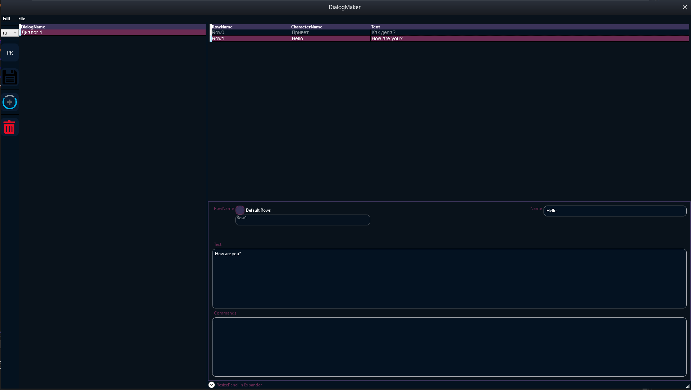
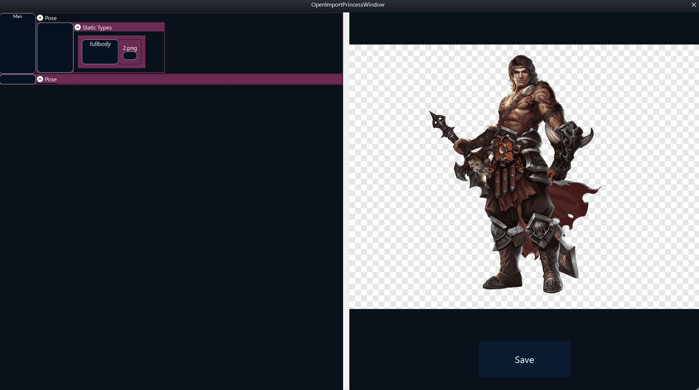
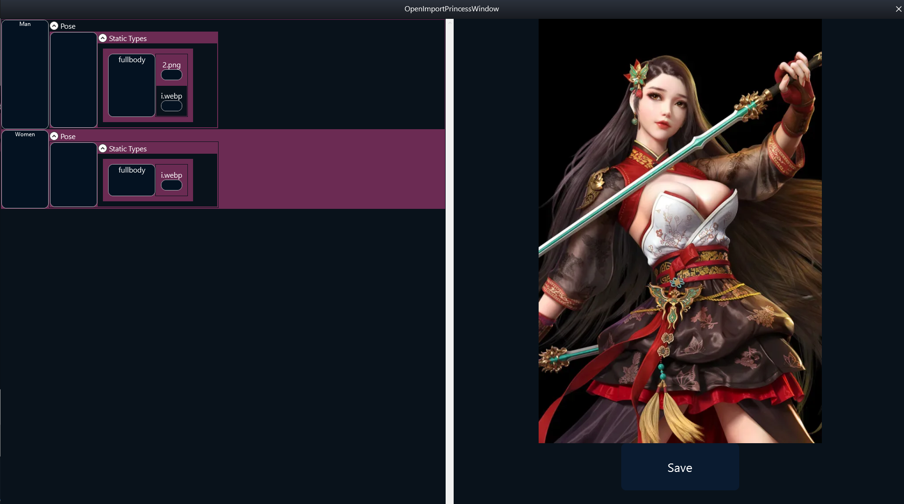
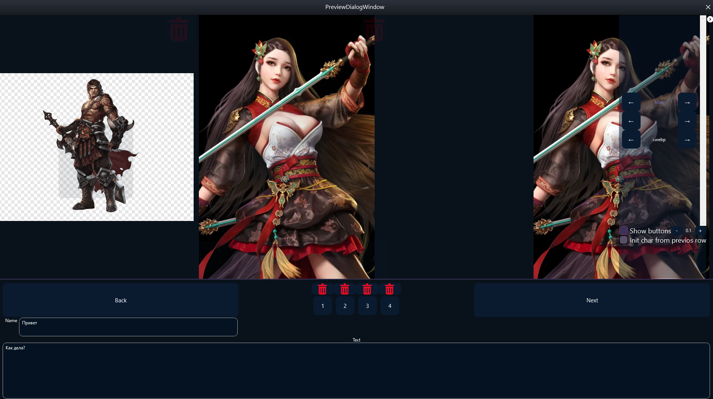

DialogMaker - Редактор диалогов для игр

DialogMaker — это мощный настольный редактор на C#/.NET, предназначенный для создания и редактирования диалоговых веток в игровых проектах. Программа предоставляет интуитивно-понятный визуальный интерфейс с поддержкой перетаскивания, управление персонажами и их эмоциями, а также удобные инструменты для предпросмотра и экспорта.

✨ Основные возможности

    📝 Визуальное создание диалогов: Создавайте диалоговые деревья с помощью удобного интерфейса.
    
  

    👥 Управление персонажами: Добавляйте и редактируйте персонажей, назначайте им имена и другие атрибуты.
    
            
 
 
 
    😊 Управление эмоциями: Создавайте наборы эмоций (настроений) для каждого персонажа (например, "радостный", "грустный", "злой").

    🧩 Drag & Drop сортировка: Легко меняйте порядок реплик в диалоге, просто перетаскивая их мышью.

    👀 Окно предпросмотра: Мгновенно просматривайте, как будет выглядеть готовый диалог в игре.
    
 
 
    🖼️ Импорт ресурсов: Специальное окно для импорта и наложения изображений персонажей и эмоций.

    💾 Экспорт в JSON: Все данные диалога сохраняются в структурированные JSON-файлы.

    📂 Автоматическое управление активами: Программа автоматически копирует используемые изображения в папку проекта для целостности данных.

🚀 Начало работы
Предварительные требования

    Операционная система: Windows 7 SP1 или новее (рекомендуется Windows 10/11).

    ****.NET Framework 4.7.2**: Если он не установлен, его можно скачать с официального сайта Microsoft.

        Скачать .NET Framework 4.7.2 Runtime

        *Обычно уже предустановлен в современных версиях Windows 10/11.*

Установка и запуск

    Перейдите на вкладку Releases этого репозитория.

    Запустите файл DialogMaker.exe.

(Если вы планируете выкладывать только исходный код, этот раздел можно изменить)
🛠️ Сборка из исходного кода

Если вы хотите собрать проект самостоятельно:

    Клонируйте репозиторий:
    bash

    git clone https://github.com/D1n976/DialogMaker.git

    Откройте файл решения DialogMaker.sln в Visual Studio 2019 или новее.

    Восстановите все NuGet-пакеты (должно произойти автоматически).

    Убедитесь, что в настройках проекта выбрана целевая платформа .NET Framework 4.7.2.

    Соберите решение (Ctrl + Shift + B) и запустите его (F5).

📖 Как пользоваться

    Создание нового диалога: Файл -> Новый.

    Добавление персонажа: Воспользуйтесь панелью управления персонажами, чтобы добавить нового, указать его имя и импортировать основное изображение.

    Добавление эмоций: Для выбранного персонажа добавьте эмоции и загрузите для каждой соответствующую иконку или спрайт.

    Создание реплик: В главном окне добавляйте новые строки диалога, выбирайте для них персонажа и нужную эмоцию.

    Изменение порядка: Перетаскивайте строки диалога, чтобы выстроить нужную последовательность.

    Предпросмотр: Нажмите кнопку "Предпросмотр", чтобы увидеть диалог в том виде, в котором он будет показан в игре.

    Сохранение: Файл -> Сохранить. Программа создаст JSON-файл с диалогом и папку Assets со всеми используемыми изображениями.

Структура JSON-файла

Диалоги сохраняется в JSON с понятной структурой:
json

{
  "Dialogs": [
    {
      "LocalizadTexts": [
        {
          "Culture": "ru",
          "CharacterName": "Привет",
          "Text": "Как дела?"
        },
        {
          "Culture": "eu",
          "CharacterName": "",
          "Text": ""
        },
        {
          "Culture": "jp",
          "CharacterName": "",
          "Text": ""
        }
      ],
      "RowName": "Row0",
      "CommandEventsString": "aerh",
      "Characters": [
        {
          "Name": "Man",
          "Poses": [
            {
              "PoseName": "",
              "StaticCharactersClothes": [
                {
                  "ClothType": {
                    "Name": "fullbody"
                  },
                  "Clothes": [
                    {
                      "ImagePath": "2.png",
                      "UnrealTexturePath": "/Script/Engine.Texture2D'/Game/DialogsData/Images/2.2'",
                      "SpriteInfoName": ""
                    },
                    {
                      "ImagePath": "i.webp",
                      "UnrealTexturePath": "/Script/Engine.Texture2D'/Game/DialogsData/Images/i.i'",
                      "SpriteInfoName": ""
                    }
                  ],
                  "StaticPathIndex": 1
                }
              ],
              "StaticCharacterClothesIndex": 0
            }
          ],
          "PoseIndex": 0,
          "Position": 2
        },
        {
          "Name": "Man",
          "Poses": [
            {
              "PoseName": "",
              "StaticCharactersClothes": [
                {
                  "ClothType": {
                    "Name": "fullbody"
                  },
                  "Clothes": [
                    {
                      "ImagePath": "2.png",
                      "UnrealTexturePath": "/Script/Engine.Texture2D'/Game/DialogsData/Images/2.2'",
                      "SpriteInfoName": ""
                    },
                    {
                      "ImagePath": "i.webp",
                      "UnrealTexturePath": "/Script/Engine.Texture2D'/Game/DialogsData/Images/i.i'",
                      "SpriteInfoName": ""
                    }
                  ],
                  "StaticPathIndex": 0
                }
              ],
              "StaticCharacterClothesIndex": 0
            }
          ],
          "PoseIndex": 0,
          "Position": 1
        },
        {
          "Name": "Man",
          "Poses": [
            {
              "PoseName": "",
              "StaticCharactersClothes": [
                {
                  "ClothType": {
                    "Name": "fullbody"
                  },
                  "Clothes": [
                    {
                      "ImagePath": "2.png",
                      "UnrealTexturePath": "/Script/Engine.Texture2D'/Game/DialogsData/Images/2.2'",
                      "SpriteInfoName": ""
                    },
                    {
                      "ImagePath": "i.webp",
                      "UnrealTexturePath": "/Script/Engine.Texture2D'/Game/DialogsData/Images/i.i'",
                      "SpriteInfoName": ""
                    }
                  ],
                  "StaticPathIndex": 1
                }
              ],
              "StaticCharacterClothesIndex": 0
            }
          ],
          "PoseIndex": 0,
          "Position": 7
        }
      ]
    },
    {
      "LocalizadTexts": [
        {
          "Culture": "ru",
          "CharacterName": "Hello",
          "Text": "How are you?"
        },
        {
          "Culture": "eu",
          "CharacterName": "adergaergreaw",
          "Text": "aerthearh"
        },
        {
          "Culture": "jp",
          "CharacterName": "",
          "Text": ""
        }
      ],
      "RowName": "Row1",
      "CommandEventsString": "",
      "Characters": []
    }
  ]
}
Объект диалога (Dialog)

    LocalizadTexts: Массив локализованных текстов для разных языков

    RowName: Уникальный идентификатор строки диалога

    CommandEventsString: Строка с командами или событиями

    Characters: Массив персонажей, участвующих в диалоге

Локализованный текст (LocalizadText)

    Culture: Код языка/культуры (ru, eu, jp)

    CharacterName: Имя персонажа для данной локализации

    Text: Текст реплики для данной локализации

Персонаж (Character)

    Name: Имя персонажа

    Poses: Массив поз персонажа

    PoseIndex: Индекс текущей позы

    Position: Позиция персонажа на экране

Поза (Pose)

    PoseName: Название позы

    StaticCharactersClothes: Массив элементов одежды

    StaticCharacterClothesIndex: Индекс текущей одежды

Элемент одежды (ClothType)

    Name: Тип одежды (например, "fullbody")

    Clothes: Массив предметов одежды

    StaticPathIndex: Индекс пути

Предмет одежды (Cloth)

    ImagePath: Путь к файлу изображения

    UnrealTexturePath: Путь к текстуре в Unreal Engine

    SpriteInfoName: Название информации о спрайте
    
📜 Лицензия

Этот проект распространяется под лицензией MIT. Подробную информацию можно найти в файле LICENSE.
🤝 Вклад в проект

Вклады приветствуются! Если у вас есть предложения по улучшению, идеи для новых функций или вы нашли ошибку:

    Создайте Issue, подробно описав проблему или предложение.

    Или сделайте Fork репозитория, создайте ветку с вашим изменением и отправьте Pull Request.
